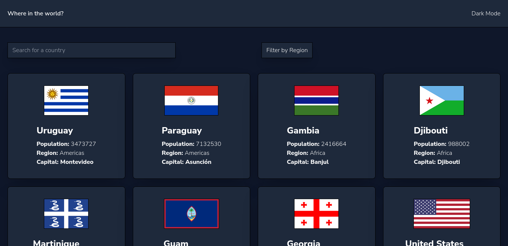
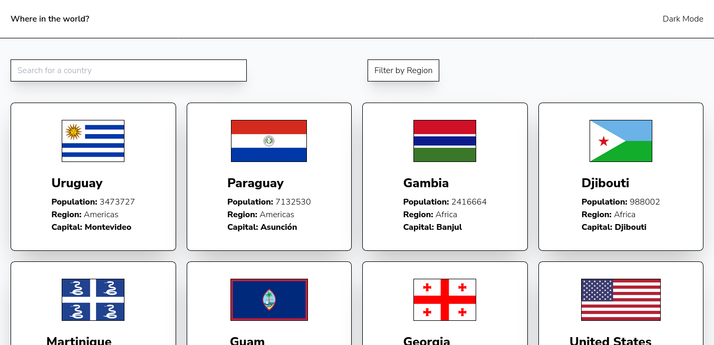

# Frontend Mentor - REST Countries API with color theme switcher solution

This is a solution to the [REST Countries API with color theme switcher challenge on Frontend Mentor](https://www.frontendmentor.io/challenges/rest-countries-api-with-color-theme-switcher-5cacc469fec04111f7b848ca). Frontend Mentor challenges help you improve your coding skills by building realistic projects.

## Table of contents

- [Overview](#overview)
  - [The challenge](#the-challenge)
  - [Screenshot](#screenshot)
  - [Links](#links)
- [My process](#my-process)
  - [Built with](#built-with)
- [Author](#author)

## Overview

### The challenge

Users should be able to:

- See all countries from the API on the homepage
- Search for a country using an `input` field
- Filter countries by region
- Click on a country to see more detailed information on a separate page
- Toggle the color scheme between light and dark mode

### Screenshot

### Links

- Solution URL: [FrontendMentor](https://www.frontendmentor.io/solutions/responsive-countries-landing-page-with-rest-api-vuejs-and-tailwind-rJ4p6c-Bq)
- Live Site URL: [Vercel](https://vercel.com/ramonapereira/countries-api-color-theme-switcher)

## My process

### Built with

- Semantic HTML5 markup
- Flexbox
- Mobile-first workflow
- Composition API
- Script setup
- [Vue.js](https://vuejs.org/) - JavaScript framework
- [Axios](https://axios-http.com/ptbr/docs/intro) - JS library
- [Tailwind](https://tailwindcss.com/) - For styles

## Author

- Website - [Ramon Pereira](https://github.com/RamonAPereira)
- Frontend Mentor - [@ramonapereira](https://www.frontendmentor.io/profile/RamonAPereira)
- Twitter - [@ramonnzd](https://www.twitter.com/ramonnzd)
